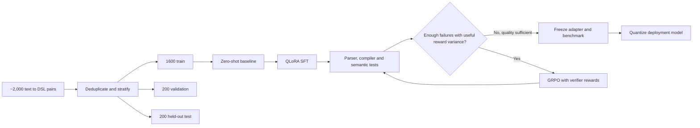
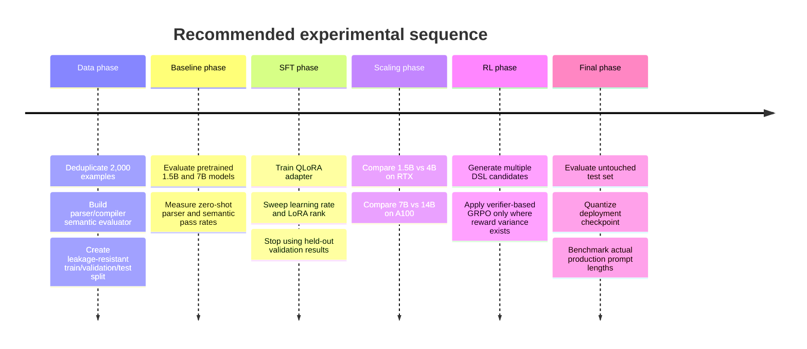

# Open-Source LLMs for Text-to-Custom-DSL Fine-Tuning on RTX 2080 Ti and A100 40 GB

## Executive summary

For a project with roughly **2,000 supervised text → custom DSL examples**, the highest-return strategy is not to start with reinforcement learning. Start with a strong code-pretrained model, perform **LoRA/QLoRA supervised fine-tuning**, evaluate with a real DSL parser/compiler/test harness, and only then add **GRPO with verifiable rewards** if there is meaningful residual error. PPO is technically possible, but for this task and data volume it is generally a worse engineering trade-off because contemporary PPO implementations require additional reward/value/reference components, whereas GRPO was explicitly designed to remove the critic and reduce PPO's memory burden. Current TRL also supports GRPO directly with PEFT and bitsandbytes QLoRA. citeturn17search23turn16view5turn20view5

My primary model recommendations are:

| Hardware | Recommended starting point | Higher-quality option | RL recommendation |
|---|---|---|---|
| **RTX 2080 Ti, 11 GB** | **Qwen2.5-Coder-1.5B-Instruct, 4-bit NF4 QLoRA** | **Qwen3-4B-Instruct-2507 QLoRA**; Qwen2.5-Coder-7B is a tight-memory experiment | SFT first. GRPO realistically on 1.5B, perhaps 4B with aggressive constraints. Avoid PPO except as a research exercise. |
| **A100, assumed 40 GB** | **Qwen2.5-Coder-7B-Instruct, BF16 LoRA or 4-bit QLoRA** | **Qwen2.5-Coder-14B QLoRA**, then **Qwen3-Coder-30B-A3B** or **Qwen2.5-Coder-32B** for maximum-capacity experiments | GRPO is practical on 7B and usually 14B. A single 40 GB GPU makes 30B/32B online RL much less attractive than their SFT. |

The strongest evidence for Qwen2.5-Coder-7B is unusually good for this use case. In the Qwen2.5-Coder technical report it scores **88.4 HumanEval, 84.1 HumanEval+, 83.5 MBPP, 71.7 MBPP+, 41.0 BigCodeBench Full, 37.6 LiveCodeBench, and 76.5 average MultiPL-E**, materially ahead of the 1.5B model and DeepSeek-Coder-V2-Lite on several code-generation and code-reasoning tests. citeturn19view0turn19view2

On the 11 GB card, however, **1.5B is the safer development model**. Qwen's published A100 benchmark measured Qwen2.5-1.5B at only **1.18 GB GPU memory in GPTQ-Int4 inference** and the 7B at **5.52 GB**, but training requires additional activations, gradients for adapters, optimizer state, CUDA workspace and temporary buffers. Thus the published inference footprints substantially understate fine-tuning requirements. citeturn14view0turn14view1

The RTX 2080 Ti is also a materially different training platform from an A100. It has **11,264 MB GDDR6 and 616 GB/s bandwidth**, supports FP16 tensor operations, but standard FlashAttention-2 targets Ampere/Ada/Hopper and BF16 requires those newer architectures. The A100 40 GB offers **40 GB HBM2, 1,555 GB/s bandwidth and native BF16/FP16 Tensor Core throughput**, making BF16 LoRA and FlashAttention-2 straightforward. citeturn21view1turn21view2turn16view0turn15view3

Most importantly, **2,000 examples are enough to test whether the base model can learn your DSL, but not enough to tolerate sloppy data design**. The target should be a narrow specialization with strong pretrained priors, not learning programming or instruction following from scratch. The QLoRA study itself found that comparatively small, high-quality instruction datasets could produce strong adaptation, although that result does not establish that 2,000 examples will be sufficient for an arbitrary DSL. citeturn10search4turn17search6

My preferred experiment sequence is therefore:



The main unknowns that you did **not** specify are the average input length, average DSL output length, complexity of the DSL, availability of a parser/compiler or executable semantic test suite, CPU RAM, PCIe generation, and whether the A100 is PCIe or SXM. I assume **one GPU**, **A100 40 GB**, Linux/CUDA, an average packed SFT example of approximately **768 tokens**, maximum training lengths around **1,024 tokens on the 2080 Ti and 2,048 tokens on the A100**, and that DSL outputs are normally below about **256 tokens**. All wall-time and training-memory figures below are consequently **planning estimates rather than measured benchmarks**.

## Model landscape and benchmark evidence

The term "open-source LLM" is somewhat imprecise in this market. I would favor models under **Apache 2.0** for a project that may later be productized. Qwen2.5-Coder 0.5B, 1.5B, 7B, 14B and 32B are Apache 2.0; its 3B checkpoint instead uses the Qwen Research license. StarCoder2 uses BigCode OpenRAIL-M, and DeepSeek-Coder-V2 uses DeepSeek's model-license terms rather than Apache 2.0. citeturn20view1turn1search14turn1search10

For that reason I would **not select Qwen2.5-Coder-3B as the default 2080 Ti model**, despite its attractive size. Qwen2.5-Coder-1.5B, Qwen3-4B and Qwen2.5-Coder-7B offer cleaner licensing choices. citeturn20view1turn4search1

### Candidate quality

| Model | Parameters / architecture | License status | Representative code evidence | Project assessment |
|---|---:|---|---|---|
| **Qwen2.5-Coder-1.5B-Instruct** | 1.54B dense | Apache 2.0 | HumanEval **70.7**, HE+ 66.5, LiveCodeBench **15.7**, MultiPL-E **56.7** | **Best 2080 Ti starting model**. Enough coding prior to learn a narrow DSL without consuming the entire VRAM budget. |
| **StarCoder2-3B** | ~3B dense | BigCode OpenRAIL-M | Base model HumanEval about **31.7** and MultiPL-E about **31.1** in Qwen's comparison | Useful older baseline, especially to test base-model adaptation, but weaker than newer Qwen code models. |
| **Qwen3-4B-Instruct-2507** | ~4B dense | Apache 2.0 family | LiveCodeBench v6 **35.1**, MultiPL-E **76.8** | **Very interesting 2080 Ti challenger**. Not code-specific in the same way as Qwen2.5-Coder, but substantially newer and strong at code. |
| **Qwen2.5-Coder-7B-Instruct** | 7.61B dense | Apache 2.0 | HumanEval **88.4**, HE+ 84.1, LiveCodeBench **37.6**, MultiPL-E **76.5**, CRUXEval 65.8/65.9 | **Best default on A100; stretch model on 2080 Ti.** Excellent code-specialization evidence. |
| **DeepSeek-Coder-V2-Lite-Instruct** | 16B total, 2.4B active MoE | DeepSeek model license | HumanEval **81.1**, LiveCodeBench **24.3**, MultiPL-E **73.2**, CRUXEval 53.0/52.9 | Good A100 alternative. Low active compute, but all ~16B weights still consume storage/VRAM. |
| **Qwen2.5-Coder-14B-Instruct** | ~14.7B dense | Apache 2.0 | Later member of same coder family; the original v1 technical-report table does not provide the clean 14B row used for the 1.5B/7B comparison | **A100 quality/cost sweet-spot candidate**. Benchmark directly on your DSL before assuming scaling beats 7B. |
| **Qwen3-Coder-30B-A3B-Instruct** | 30.5B total, **3.3B active**, 128 experts / 8 active | Apache 2.0 | Newer specialized coding MoE; official serving benchmarks show high optimized-kernel throughput, but framework/runtime choice matters enormously | **Promising A100 SFT candidate**, but more tooling-sensitive than dense Qwen2.5-Coder. |
| **Qwen2.5-Coder-32B-Instruct** | ~32.5B dense | Apache 2.0 | Qwen's later family release reports strong high-end coding/editor performance, including **73.7 on Aider** | Maximum dense-model option that is realistically QLoRA-fine-tunable on one A100 40 GB. Not attractive for single-GPU online RL. |

The first four benchmark rows are grounded in the Qwen2.5-Coder technical report and the Qwen3 model card. The DeepSeek results are particularly useful because Qwen evaluated DeepSeek-Coder-V2-Lite alongside Qwen2.5-Coder under the same tables rather than comparing unrelated leaderboard numbers. citeturn19view0turn19view2turn4search6

Qwen2.5-Coder-7B's model card specifies **7.61B parameters, 28 layers, GQA with 28 query and 4 KV heads, and up to 131,072-token context**, although your project should deliberately train at a far smaller sequence length unless long contexts are actually required. Context capacity is not free: activation and KV-cache memory grow substantially with sequence length. citeturn18search0turn15view5

DeepSeek-Coder-V2-Lite is an unusual candidate because it has approximately **16B total but 2.4B active parameters**. DeepSeek describes the underlying V2-Lite model as deployable on one 40 GB GPU, though its published full fine-tuning setup was far larger. For your project, that means PEFT/QLoRA rather than conventional full-parameter fine-tuning. citeturn18search3turn18search7

Qwen3-Coder-30B-A3B is similarly an MoE: only about **3.3B of 30.5B parameters are active per token**, but this does **not** mean it has a 3.3B model's memory footprint. All expert weights must remain available. Raw BF16 parameter storage is about 61 GB, while the theoretical 4-bit payload is about 15.25 GB before quantization metadata and runtime state. citeturn1search4turn20view3

### Inference footprint and throughput

The following Qwen2.5 measurements are especially useful because they are official and use the same methodology. They were obtained on an **A100 80 GB**, not the 40 GB A100 requested here, with Transformers, batch size 1, a one-token prompt, and generation of 2,048 tokens. Qwen's environment used CUDA 12.1 and FlashAttention 2.5.8. Thus these are **reference benchmarks, not predictions for your A100 40 GB or 2080 Ti**. citeturn15view0

| Model | BF16 measured memory | BF16 speed | GPTQ-Int4 measured memory | GPTQ-Int4 speed | Approx. decode latency from published int4 speed |
|---|---:|---:|---:|---:|---:|
| Qwen2.5 1.5B | 2.95 GB | 39.68 tok/s | **1.18 GB** | **43.33 tok/s** | ~23.1 ms/token |
| Qwen2.5 7B | 14.38 GB | 40.38 tok/s | **5.52 GB** | **43.10 tok/s** | ~23.2 ms/token |
| Qwen2.5 14B | 28.08 GB | 24.74 tok/s | **9.94 GB** | **25.89 tok/s** | ~38.6 ms/token |
| Qwen2.5 32B | 61.58 GB | 17.54 tok/s | **18.94 GB** | **19.20 tok/s** | ~52.1 ms/token |

These values come directly from Qwen's Transformers measurements. At a 6,144-token input, for example, the 7B GPTQ-Int4 footprint rises from 5.52 to **6.52 GB**, the 14B rises from 9.94 to **11.36 GB**, and the 32B rises from 18.94 to **21.09 GB**, illustrating why context length must be included in VRAM planning. citeturn14view0turn14view1turn14view2turn14view3

The A100 40 GB should not be assumed to match the above 80 GB model's decode rate. NVIDIA specifies **1,555 GB/s** memory bandwidth for A100 40 GB versus **1,935 GB/s PCIe or 2,039 GB/s SXM** for A100 80 GB variants. Autoregressive decoding is often substantially memory-bandwidth constrained, so measuring on the actual card is necessary. citeturn15view3

For the RTX 2080 Ti, I did not find an equally controlled primary-source benchmark for exactly Qwen2.5-Coder under QLoRA-compatible Transformers. A useful **community hardware reference**, not an apples-to-apples model benchmark, is llama.cpp's CUDA scoreboard: a 6.74B Llama-family Q4_0 model on an RTX 2080 Ti reached approximately **107.5 tokens/s token generation without its FA option and 109.2 tok/s with it**, while prompt processing was ~2,891 to 3,108 tok/s. This demonstrates that 7B-class 4-bit inference is entirely viable on the card, but it should not be used to predict Hugging Face Qwen training or inference speed because the model, quantizer, kernel stack and benchmark methodology differ. citeturn21view0

Qwen3 benchmarks further demonstrate how much runtimes matter. On an H20 96 GB, Qwen3-4B AWQ-INT4 consumed **2,915 MB** in Transformers at the one-token input point and reported 51.57 tokens/s under Qwen's metric. For Qwen3-30B-A3B, optimized SGLang reported 137.18 tokens/s BF16 and 155.55 FP8 at input length 1, while plain Transformers produced dramatically poorer MoE throughput. Qwen explicitly defines the newer benchmark's speed as total prompt plus generated tokens divided by time, so its long-prompt numbers must not be interpreted as pure decode rates. citeturn14view5turn14view4turn15view1

That runtime sensitivity is why I would choose **dense Qwen2.5-Coder-7B first**, even though newer MoE models are attractive on paper.

## RTX 2080 Ti strategy

The RTX 2080 Ti has **11,264 MB GDDR6, 616 GB/s memory bandwidth and Turing Tensor Cores with FP16/INT8/INT4 capability**. NVIDIA's Founders Edition figures list 28.5 TFLOPS peak FP16 and 113.8 Tensor TFLOPS for the relevant FP16 tensor mode. It predates native BF16 support, so your training compute dtype should be **FP16**, not BF16. citeturn21view1turn21view2turn15view2

Standard CUDA FlashAttention-2 currently lists **Ampere, Ada and Hopper** as supported architectures and directs Turing owners to the separate `flash-attention-turing` implementation. For lowest-friction training, I would start with PyTorch SDPA on this GPU rather than making a specialized Turing FlashAttention build a dependency. citeturn16view0

### What actually fits

| Candidate | Inference | SFT on 11 GB | GRPO on 11 GB | Suggested configuration | Estimated SFT peak VRAM* |
|---|---|---|---|---|---:|
| **Qwen2.5-Coder-1.5B** | Easy FP16 or 4-bit | **Very practical** | **Practical** | NF4 QLoRA, FP16 compute, LoRA r=16, seq 1,024-2,048 | ~4-7 GB |
| **StarCoder2-3B** | Easy 4-bit | Practical | Marginal | NF4 QLoRA, r=16, seq ~1,024 | ~6-9 GB |
| **Qwen3-4B-Instruct** | Easy 4-bit | **Practical but tight** | Marginal | NF4 QLoRA, r=16, microbatch 1, checkpointing | ~7-10.5 GB |
| **Qwen2.5-Coder-7B** | **Practical 4-bit** | **Possible but fragile** | Not recommended | NF4 QLoRA, seq 512-1,024, microbatch 1, r=8-16 | ~9.5-11 GB |
| DeepSeek-Coder-V2-Lite | Borderline 4-bit | Not sensible | No | Needs ~8 GB raw 4-bit weights before runtime overhead | >11 GB likely |
| 14B+ dense | CPU-offloaded inference possible | No practical single-GPU training | No | Use A100 instead | >11 GB |

\*The SFT peak-VRAM figures are **engineering estimates**, not published model benchmarks. They assume gradient checkpointing, one GPU, short sequences and LoRA rather than full fine-tuning. Actual memory depends strongly on sequence length, attention implementation, optimizer, allocator fragmentation and PEFT target modules. PEFT and TRL explicitly support combining adapters with 4/8-bit quantization and checkpointing to reduce memory. citeturn17search6turn21view3turn21view4

**Qwen2.5-Coder-1.5B should be the first model trained.** It is sufficiently code-aware to provide a meaningful test of the data pipeline, and its published HumanEval/MBPP/MultiPL-E results are much stronger than parameter count alone suggests. citeturn19view0

**Qwen3-4B-Instruct-2507 should be the second experiment.** Its LiveCodeBench v6 and MultiPL-E results are competitive with larger older code models, while its official AWQ-INT4 inference footprint of about 2.9 GB on the Qwen H20 test leaves much more theoretical headroom than a 7B model. citeturn4search6turn14view5

**Qwen2.5-Coder-7B on 11 GB is a stretch configuration, not the development default.** Published int4 inference occupies 5.52 GB in Qwen's A100 Transformers measurement, but backpropagation activations consume the remaining budget quickly. Restrict sequences to roughly 512-1,024 tokens initially, microbatch 1, gradient checkpointing on, and avoid CPU offload unless needed because PCIe transfers can erase much of the model-quality advantage in training throughput. citeturn14view1turn21view4

My initial SFT settings on the 2080 Ti would be:

| Setting | 1.5B | 4B | 7B stretch |
|---|---:|---:|---:|
| Weight format | NF4 4-bit | NF4 4-bit | NF4 4-bit |
| Compute | FP16 | FP16 | FP16 |
| LoRA rank | 16, optionally 32 | 16 | 8-16 |
| LoRA alpha | 32 | 32 | 16-32 |
| LoRA dropout | 0.05 | 0.05 | 0.05 |
| Target modules | `all-linear` | `all-linear` | `all-linear`, reduce if OOM |
| LR | `1e-4` to `2e-4` | `8e-5` to `1.5e-4` | `5e-5` to `1e-4` |
| Epochs | 3 initially, test 3-6 | 3 initially | 2-4 |
| Microbatch | 2-4 | 1 | 1 |
| Gradient accumulation | 8-16 | 16-32 | 16-32 |
| Effective batch target | 16-32 | 16-32 | 16-32 |
| Max sequence | 1,024 initially | ~1,024 | 512-1,024 |
| Optimizer | paged AdamW 8-bit | same | same |
| Checkpointing | On | On | Mandatory |

Those are **project-specific starting hyperparameters, not vendor-prescribed defaults**. PEFT recommends `target_modules="all-linear"` for QLoRA-style training, and Hugging Face recommends NF4 for training a 4-bit base model. citeturn17search2turn17search1

Under my explicitly stated **768 average-token assumption**, 2,000 examples correspond to roughly 1.54 million tokens per epoch and about **4.61 million token presentations over three epochs**. A conservative planning budget is roughly **3-6 hours for 1.5B**, **7-15 hours for 4B**, and **13-26 hours for the highly constrained 7B QLoRA experiment**, including a modest allowance for evaluation/checkpoint overhead. These are not measured benchmarks. They are capacity-planning ranges and should be replaced by a 50-100-step local profile as soon as the actual dataset exists.

The 1.5B model's GRPO starting point would be approximately **LR 5e-7 to 1e-6, one RL epoch, `num_generations=4`, `max_completion_length=128-256`, effective prompt batch 4-8, `beta=0`, `num_iterations=1`**, and LoRA rather than full policy updates. TRL's current GRPO defaults are LR `1e-6`, eight generations, 512 maximum completion tokens, `beta=0`, and one update iteration, but eight 512-token rollouts are needlessly expensive on an 11 GB Turing GPU for a concise DSL. citeturn16view2turn16view3turn16view4

For 500-1,000 RL prompts with four short generations each, a **several-hour GRPO run** on the 2080 Ti is a reasonable planning assumption. Generation rather than backpropagation can dominate. Do not schedule GRPO until SFT is stable enough to generate both passing and failing programs, because group-relative rewards provide little useful advantage signal if all completions receive essentially the same score. That follows directly from GRPO's group-relative advantage formulation. citeturn15view6turn16view3

## A100 40 GB strategy

For this report, **A100 means a single 40 GB A100**, as requested. NVIDIA also produced 80 GB A100 variants, but they are not assumed here. NVIDIA specifies native BF16 and FP16 Tensor Core throughput of up to 312 TFLOPS dense for A100 and 40 GB HBM2 bandwidth of 1,555 GB/s. citeturn15view3

This changes the optimal choice fundamentally. Rather than contorting a 7B model into 11 GB, the 40 GB A100 lets you choose models based primarily on DSL quality.

| Candidate | Recommended SFT mode | Est. SFT peak VRAM* | GRPO feasibility on one 40 GB A100 | Role |
|---|---|---:|---|---|
| **Qwen2.5-Coder-7B** | BF16 LoRA or NF4 QLoRA | ~12-30 GB | **Good** with QLoRA | **Default** |
| **Qwen2.5-Coder-14B** | NF4 QLoRA; BF16 LoRA only with tight batches | ~16-28 GB QLoRA | **Good to moderate** | Preferred scaling experiment |
| **DeepSeek-Coder-V2-Lite** | NF4 QLoRA | ~17-28 GB | Moderate | MoE alternative |
| **Qwen3-Coder-30B-A3B** | 4-bit QLoRA | ~25-36 GB | **Tight / experimental** | High-end SFT candidate |
| **Qwen2.5-Coder-32B** | 4-bit QLoRA | ~27-39 GB | **Not recommended on same GPU** | Maximum dense SFT candidate |

\*Again, these are planning ranges under short-sequence, gradient-checkpointed PEFT. The actual peak must be profiled. Quantized base-weight payload alone is much smaller than training peak. Qwen's published GPTQ-Int4 inference footprints are about 5.52 GB for 7B, 9.94 GB for 14B and 18.94 GB for 32B before the much larger training-specific state is considered. citeturn14view1turn14view2turn14view3

For the **7B model**, I would first test **BF16 LoRA** rather than automatically quantizing it. The raw BF16 parameter payload is about 15.2 GB, leaving meaningful space in 40 GB for activations and the relatively small LoRA optimizer state. Whether 2,048 or 4,096 tokens is comfortable depends on microbatch size, so begin at 2,048 with checkpointing and scale upward only if your actual data demands it. Native A100 BF16 and FlashAttention-2 make this a much cleaner configuration than on the 2080 Ti. citeturn18search0turn15view3turn16view0

For **14B**, QLoRA becomes my default. Its raw BF16 parameter payload is about 29.4 GB, already leaving little room on a 40 GB card for activations and temporary buffers. Qwen's measured BF16 inference footprint is 28.08 GB even at a tiny input, whereas GPTQ-Int4 is 9.94 GB. citeturn14view2

For **32B**, 4-bit is mandatory on one A100 40 GB for sensible fine-tuning. Qwen measured about **61.58 GB BF16 versus 18.94 GB GPTQ-Int4 inference memory** at the shortest input. QLoRA uses a different training-oriented quantization path, typically bitsandbytes NF4, but the measurement establishes the approximate scale of the memory reduction. citeturn14view3turn17search1

For **Qwen3-Coder-30B-A3B**, note that official Qwen testing on an H20 reported about **58.5 GB BF16 and 30.3 GB FP8** in Transformers at the shortest input. That means FP8 may fit for inference on 40 GB but is not a comfortable training configuration. Four-bit PEFT is the reasonable route. Qwen's same benchmark also shows that optimized SGLang kernels transform MoE throughput relative to generic Transformers, which makes software maturity unusually important for this model. citeturn14view4

My A100 SFT recipes would start here:

| Parameter | 7B | 14B | 30B-A3B / 32B |
|---|---:|---:|---:|
| Base format | BF16 LoRA or NF4 | NF4 | NF4 |
| LoRA rank | 16-32 | 16-32 | 8-16 initially |
| Alpha | 32-64 | 32-64 | 16-32 |
| Dropout | 0.03-0.05 | 0.03-0.05 | 0.03-0.05 |
| Learning rate | `5e-5` to `1e-4` | `5e-5` to `1e-4` | `2e-5` to `8e-5` |
| Epochs | 2-4 | 2-4 | 2-3 |
| Sequence length | 2,048 initially | 1,024-2,048 | 1,024-2,048 |
| Microbatch | 4-8 QLoRA; 2-4 BF16 | 2-4 | 1 |
| Gradient accumulation | target effective 32-64 | target 32-64 | target 16-32 |
| Attention | FlashAttention-2 | FlashAttention-2 | FA2/model-specific optimized kernel |
| Gradient checkpointing | On initially | On | Mandatory |

The point of testing **7B before 14/30/32B** is statistical as much as computational. With only 2,000 examples, model size may cease to be the dominant constraint. If 7B can already model the DSL grammar and semantics, the larger model can add cost without improving held-out pass rate. Conversely, if your prompts require substantial natural-language reasoning before emitting the DSL, the stronger large-model priors can matter.

Using the same 4.61-million-token, three-epoch planning workload as above, rough A100 wall-time budgets are **0.9-1.7 hours for 7B**, **1.7-3.4 hours for 14B**, around **1.5-3 hours for the DeepSeek 16B MoE**, **2-5 hours for Qwen3-Coder-30B-A3B QLoRA**, and **4-9 hours for a dense 32B QLoRA run**. These are deliberately broad estimates, not published performance numbers, and should not be used for capacity billing before profiling your exact stack.

For GRPO on A100, I would use **7B first**:

| Setting | Recommended initial value |
|---|---|
| Policy | SFT'd Qwen2.5-Coder-7B |
| Quantization | 4-bit NF4 QLoRA if online-RL memory is tight |
| LR | `3e-7` to `1e-6` |
| GRPO groups | 4 completions per prompt initially |
| Completion length | 128-256, based on actual DSL |
| `beta` | `0.0` initially; try `0.001` if drift appears |
| `num_iterations` | 1 |
| Loss | Start with current TRL default behavior; test `dr_grpo` if output length bias appears |
| Effective prompt batch | 16-32 |
| RL epochs | 1, then evaluate before extending to 2 |
| Generation backend | vLLM colocated if memory permits |
| Reward | parser + compiler + semantic test reward |
| Evaluation | held-out compiler/test pass, never training reward alone |

Current TRL uses `beta=0` by default, which means the reference model does not need to be loaded, reducing memory. TRL notes DeepSeek-R1 used a small `0.001` value. `num_iterations=1` and PPO-style clipping epsilon 0.2 are current defaults. citeturn16view3

That makes **7B GRPO much more attractive than PPO**. At 14B, GRPO remains plausible with four-bit policy weights, short completions and aggressive memory management. At 30B/32B, SFT is still worthwhile, but online RL on the same 40 GB card competes with rollout KV caches and inference state. TRL can put a colocated vLLM engine into sleep mode and offload its parameters/cache during optimization, but this adds host-device transfer latency. citeturn21view5

For 30B/32B, my engineering decision would therefore be **SFT them, but run GRPO on 7B or 14B unless the larger model clearly wins enough on the DSL test set to justify the complexity**.

## SFT, GRPO and PPO design for only two thousand examples

Your data regime changes how the algorithms should be used.

I recommend an initial **80/10/10 split**, approximately **1,600 train, 200 validation, 200 untouched test examples**, with grouping by underlying DSL template, domain, project, or intent rather than naïve random splitting where near-duplicates could leak across sets. With 200 independent test examples, an observed 80% pass rate has a binomial standard error of roughly 2.8 percentage points, so results from such a small test set should still be interpreted with uncertainty.

For a DSL, **perplexity is not the primary success metric**. Track at least:

| Metric | Why it matters |
|---|---|
| **Canonicalized exact match** | Measures whether output matches the expected program after irrelevant formatting normalization |
| **Parser pass rate** | Detects grammar/syntax failures |
| **Type/schema validation** | Detects structurally valid but invalid DSL constructs |
| **Compiler/interpreter success** | Stronger than syntactic validity |
| **Semantic unit-test pass rate** | The main task-quality metric if executable |
| **Pass@k** | Useful if your deployment can sample/re-rank several candidate programs |
| **Edit distance / AST distance** | Provides partial-error signal when exact match is too binary |

This also explains why **GRPO is unusually well matched to DSL generation**. DeepSeekMath introduced GRPO as a critic-free PPO variant, and TRL allows arbitrary reward functions. A DSL gives you something many natural-language RL projects lack: an objective verifier. citeturn17search23turn15view6

A useful reward is not just `1 if exact_match else 0`. For example:

```python
def dsl_reward(program: str, case) -> float:
    # Example weights, not universal constants.
    try:
        ast = parser.parse(program)
    except ParseError:
        return 0.0

    reward = 0.20  # syntactically valid

    if not schema_validator.is_valid(ast):
        return reward

    reward += 0.15

    try:
        artifact = compiler.compile(ast)
    except CompileError:
        return reward

    reward += 0.20

    passed, total = run_semantic_tests(artifact, case.tests)
    reward += 0.45 * (passed / max(total, 1))

    return min(reward, 1.0)
```

This graded reward is particularly valuable when an early policy produces few perfectly correct programs. It creates within-prompt reward variance that GRPO can exploit rather than assigning zero to every failed sample.

I would use the 2,000 labeled examples primarily for **SFT and evaluation**. GRPO can reuse training-distribution prompts, but the reward should come from the verifier rather than from memorizing reference completions. Even better, if you can cheaply produce additional unlabeled natural-language prompts and automatically judge generated DSL programs, the RL phase no longer needs to consume your scarce labeled reference outputs.

The suggested learning curve is:



### Why GRPO before PPO

Current TRL's PPO trainer takes a **reward model and a value model**, and computes KL against a reference policy as part of its RLHF workflow. The current example also illustrates PPO-specific episodes and PPO optimization epochs. citeturn20view5

GRPO, in contrast, estimates its baseline through the relative scores of a group of completions. DeepSeekMath explicitly introduced it to eliminate the critic and reduce PPO's training-resource requirement. Current TRL goes further: with the default `beta=0`, it need not load a separate reference model either. citeturn17search23turn16view3

For your use case:

**SFT → GRPO** requires:
`policy + LoRA + generated candidates + DSL verifier`.

Traditional **SFT → reward model → PPO** generally requires something closer to:
`policy + reference policy + reward model + value/critic + rollouts`.

You currently have approximately 2,000 **labeled correct outputs**, not a stated dataset of human preference pairs or scalar human ratings. Therefore there is no obvious reward-model training corpus. Building a learned human-feedback reward model would consume data and memory merely to approximate the executable DSL verifier you can potentially implement directly.

PPO would become justified if the target contains important **non-executable human preferences**, for example readability, idiomatic DSL style, maintainability, naming quality, or multiple semantically equivalent programs where humans consistently prefer one form. In that case, collect explicit chosen/rejected examples or ratings rather than pretending ordinary SFT pairs constitute RLHF data.

If PPO is required experimentally, I would constrain it roughly as follows:

| GPU | Policy | PPO LR | Effective batch | PPO epochs/update | Practical assessment |
|---|---|---:|---:|---:|---|
| RTX 2080 Ti | 1.5B QLoRA only | `1e-6` to `3e-6` | 4-8 | 1 | Technically investigable but poor use of 11 GB |
| A100 40 GB | 7B QLoRA + smaller reward/value models | `3e-7` to `1e-6` | 16-32 | 1-2 | Feasible |
| A100 40 GB | 14B+ | ≤`1e-6` | small | 1 | Usually inferior memory trade-off to GRPO |

TRL's minimal current PPO example uses a `3e-6` learning rate and one PPO epoch for a 1B demonstration, but its batch 64 is an example configuration, not a prescription for your larger code models. citeturn20view5

## Practical implementation stack

A sensible stack as of August 2026 is **PyTorch + Transformers + Datasets + PEFT + TRL + bitsandbytes + Accelerate**. Add **FlashAttention-2 on A100**, and optionally **vLLM** for GRPO rollout generation. DeepSpeed is most beneficial when multiple GPUs or CPU/NVMe offload are involved; on a single GPU, QLoRA and gradient checkpointing should be exhausted before introducing ZeRO complexity. Hugging Face documents QLoRA compatibility with DeepSpeed ZeRO stages and PEFT. citeturn17search22turn16view5

Install the core environment with:

```bash
python -m venv .venv
source .venv/bin/activate

pip install -U \
  torch \
  transformers \
  datasets \
  accelerate \
  peft \
  trl \
  bitsandbytes
```

On the **A100**:

```bash
pip install -U flash-attn --no-build-isolation

# Optional, particularly for GRPO rollout acceleration:
pip install -U vllm deepspeed
```

On the **RTX 2080 Ti**, do not blindly install standard FlashAttention-2 and expect support. Use PyTorch SDPA first:

```python
attn_implementation = "sdpa"
compute_dtype = torch.float16
```

On A100:

```python
attn_implementation = "flash_attention_2"
compute_dtype = torch.bfloat16
```

The architectural reason for this difference is explicit in FlashAttention's current CUDA requirements: FA2 supports Ampere/Ada/Hopper, while Turing uses a separate implementation, and BF16 likewise requires newer architectures. citeturn16view0

### QLoRA SFT example

A compact training skeleton for both GPUs is:

```python
import torch
from datasets import load_dataset
from transformers import (
    AutoModelForCausalLM,
    AutoTokenizer,
    BitsAndBytesConfig,
)
from peft import (
    LoraConfig,
    prepare_model_for_kbit_training,
)
from trl import SFTConfig, SFTTrainer

MODEL_ID = "Qwen/Qwen2.5-Coder-1.5B-Instruct"
IS_A100 = torch.cuda.get_device_capability(0)[0] >= 8

compute_dtype = torch.bfloat16 if IS_A100 else torch.float16
attention_impl = "flash_attention_2" if IS_A100 else "sdpa"

quant_config = BitsAndBytesConfig(
    load_in_4bit=True,
    bnb_4bit_quant_type="nf4",
    bnb_4bit_use_double_quant=True,
    bnb_4bit_compute_dtype=compute_dtype,
)

tokenizer = AutoTokenizer.from_pretrained(MODEL_ID)

model = AutoModelForCausalLM.from_pretrained(
    MODEL_ID,
    quantization_config=quant_config,
    torch_dtype=compute_dtype,
    attn_implementation=attention_impl,
    device_map={"": 0},
)

model = prepare_model_for_kbit_training(
    model,
    use_gradient_checkpointing=True,
)

lora_config = LoraConfig(
    r=16,
    lora_alpha=32,
    lora_dropout=0.05,
    target_modules="all-linear",
    bias="none",
    task_type="CAUSAL_LM",
)

dataset = load_dataset(
    "json",
    data_files={
        "train": "train.jsonl",
        "validation": "validation.jsonl",
    },
)

train_args = SFTConfig(
    output_dir="dsl-sft",
    num_train_epochs=3,
    learning_rate=1e-4,
    per_device_train_batch_size=2 if MODEL_ID.endswith("1.5B-Instruct") else 1,
    per_device_eval_batch_size=1,
    gradient_accumulation_steps=16,
    max_length=1024,
    packing=True,
    gradient_checkpointing=True,
    fp16=not IS_A100,
    bf16=IS_A100,
    logging_steps=10,
    eval_strategy="steps",
    eval_steps=50,
    save_steps=50,
    save_total_limit=2,
    warmup_ratio=0.05,
    lr_scheduler_type="cosine",
    report_to="tensorboard",
)

trainer = SFTTrainer(
    model=model,
    args=train_args,
    train_dataset=dataset["train"],
    eval_dataset=dataset["validation"],
    processing_class=tokenizer,
    peft_config=lora_config,
)

trainer.train()
trainer.save_model("dsl-sft/final")
```

NF4 and LoRA-over-all-linear-layers follow Hugging Face's documented QLoRA recommendations. citeturn17search1turn17search2

Represent the dataset as explicit prompt/completion records rather than concatenating everything manually:

```json
{"prompt":"Translate the following request into MyDSL:\nCreate a counter named hits starting at zero.", "completion":"counter hits = 0;"}
```

Keep the system/instruction prefix **identical between training and inference** unless you deliberately include several prompt formats. For this narrow task, unnecessary prompt variation wastes part of the small data budget.

### GRPO example

Current TRL's GRPO trainer directly accepts both `quantization_config` and `peft_config`, which makes QLoRA-based online RL possible without first materializing a full-precision trainable policy. citeturn16view5turn16view6

A simplified verifier-driven configuration is:

```python
import torch
from peft import LoraConfig
from transformers import BitsAndBytesConfig
from trl import GRPOConfig, GRPOTrainer

MODEL_ID = "dsl-sft/final"

quant_config = BitsAndBytesConfig(
    load_in_4bit=True,
    bnb_4bit_quant_type="nf4",
    bnb_4bit_use_double_quant=True,
    bnb_4bit_compute_dtype=torch.bfloat16,  # A100
)

lora_config = LoraConfig(
    r=16,
    lora_alpha=32,
    lora_dropout=0.0,
    target_modules="all-linear",
    task_type="CAUSAL_LM",
)

def reward_dsl(completions, tests=None, **kwargs):
    rewards = []

    for program, test_spec in zip(completions, tests):
        try:
            ast = parser.parse(program)
        except Exception:
            rewards.append(0.0)
            continue

        reward = 0.20

        if schema_validator.is_valid(ast):
            reward += 0.15
        else:
            rewards.append(reward)
            continue

        try:
            executable = compiler.compile(ast)
            reward += 0.20
        except Exception:
            rewards.append(reward)
            continue

        passed, total = run_tests(executable, test_spec)
        reward += 0.45 * passed / max(total, 1)

        rewards.append(min(reward, 1.0))

    return rewards


args = GRPOConfig(
    output_dir="dsl-grpo",
    learning_rate=5e-7,
    num_train_epochs=1,

    # Effective batch must be divisible by num_generations.
    per_device_train_batch_size=4,
    gradient_accumulation_steps=4,
    num_generations=4,

    max_completion_length=256,
    beta=0.0,
    num_iterations=1,

    gradient_checkpointing=True,
    bf16=True,

    # A100:
    use_vllm=True,
    vllm_mode="colocate",

    logging_steps=5,
    report_to="tensorboard",
)

trainer = GRPOTrainer(
    model=MODEL_ID,
    reward_funcs=reward_dsl,
    args=args,
    train_dataset=rl_dataset,
    quantization_config=quant_config,
    peft_config=lora_config,
)

trainer.train()
```

TRL requires the effective batch to be divisible by `num_generations`; its current default is eight generations, while I recommend four because your outputs should be much shorter and the project is compute-constrained. citeturn16view4

For the 2080 Ti, use the same conceptual code with FP16 and much smaller batch settings, and initially leave vLLM out:

```python
GRPOConfig(
    learning_rate=5e-7,
    num_train_epochs=1,
    per_device_train_batch_size=1,
    gradient_accumulation_steps=4,
    num_generations=4,
    max_completion_length=128,
    beta=0.0,
    gradient_checkpointing=True,
    fp16=True,
    use_vllm=False,
)
```

### Memory escalation ladder

Do not enable every optimization simultaneously. Debugging becomes unnecessarily difficult. Apply them in this order:

**First:** four-bit NF4 + LoRA + gradient checkpointing + short maximum sequence length. QLoRA was specifically developed around a frozen 4-bit base plus trainable LoRA adapters; bitsandbytes remains Hugging Face's standard QLoRA route. citeturn10search4turn17search13

**Then:** dataset packing. This is particularly valuable when individual DSL examples are short because it reduces padding waste; TRL's SFT stack supports packing. citeturn7search2

**Then:** on A100, FlashAttention-2. On Turing, remain with SDPA unless profiling justifies the separate Turing-specific implementation. citeturn16view0

**Then:** activation offloading if the model is just barely over budget. TRL can temporarily store activations in CPU RAM, explicitly trading speed for lower GPU peak memory. citeturn21view4

**Then:** DeepSpeed/CPU offload. ZeRO can shard or offload optimizer/parameter state, but a one-GPU consumer setup gains memory at the price of host-device traffic. citeturn17search22turn10search7

For GRPO specifically, TRL can additionally disable model gathering under ZeRO-3 and can use **vLLM sleep mode** to move rollout weights/cache out of GPU memory during the optimization phase. citeturn21view4turn21view5

TRL also exposes **Liger kernels**, documenting up to roughly 20% multi-GPU throughput improvement and 60% memory reduction in supported workloads. I would treat those as optimization opportunities after a conventional baseline rather than assumptions in your capacity plan. citeturn21view3

## Risks, limitations and final recommendation

The largest risk is **overfitting the 2,000 examples rather than failing to fit them**. A 7B or 14B pretrained coder can memorize a small DSL corpus easily. Training loss is therefore not a useful stopping criterion by itself. Choose checkpoints by held-out parser/compiler/semantic pass rate and inspect performance by DSL construct, not only overall average.

A closely related risk is **data leakage through templated examples**. If ten rows differ only in variable names and variants are randomly placed into train and test sets, the measured exact-match or pass rate can badly overstate generalization. Group splitting by intent/template/source is more important than squeezing another epoch from the model.

Another limitation is that **standard code benchmarks are proxies rather than DSL benchmarks**. HumanEval, MBPP, LiveCodeBench, MultiPL-E and CRUXEval demonstrate pretrained programming and reasoning ability, but none proves that Qwen2.5-Coder-7B will beat Qwen3-4B on your syntax. The Qwen report itself measures conventional languages and code reasoning, not arbitrary proprietary DSL induction. citeturn19view0turn19view2

Quantization introduces another distinction: **use bitsandbytes NF4 for QLoRA training; use GPTQ/AWQ/GGUF primarily as deployment/inference formats** unless your chosen training framework explicitly supports otherwise. Hugging Face identifies bitsandbytes as the established QLoRA route, while Qwen's official GGUF releases make Q4 deployment through llama.cpp straightforward after training/adapter merging. citeturn17search13turn18search8

GRPO also has a task-specific failure mode. Because its advantages are defined relative to other generations for the same prompt, groups where every output receives nearly identical rewards provide little learning signal. That means a binary compile/no-compile reward can be poor when the policy is either extremely weak or nearly perfect. A staged parser/schema/compiler/test reward is therefore preferable. The issue follows from the group-relative formulation used by GRPO. citeturn16view3turn17search23

PPO has an additional reward-hacking risk because a learned reward model can be exploited by the policy. In this project, a deterministic parser/compiler/test environment sharply reduces the reason to train such a reward model in the first place. Current TRL's PPO architecture explicitly includes reward and value models, while GRPO accepts callable reward functions directly. citeturn20view5turn15view6

Safety concerns depend on what the DSL controls. If generated programs can trigger infrastructure, financial actions, file deletion, network operations, physical systems, or privileged execution, **syntactic validity is not sufficient safety validation**. Generated code should execute in a constrained interpreter/sandbox with allowlisted operations, bounded resources and validation independent from the model. The model's probability distribution should never be the authorization mechanism.

The decisive hardware trade-off is therefore:

| Question | RTX 2080 Ti 11 GB | A100 40 GB |
|---|---|---|
| Lowest-risk SFT | **1.5B QLoRA** | **7B LoRA/QLoRA** |
| Best model worth testing next | **Qwen3 4B** | **Qwen2.5-Coder 14B** |
| 7B SFT | Possible but constrained | Easy |
| 14B SFT | No practical single-GPU setup | Very practical with QLoRA |
| 30B/32B SFT | No | Feasible with 4-bit QLoRA |
| GRPO | 1.5B preferred | 7B preferred, 14B viable |
| PPO | Generally avoid | 7B possible, but GRPO better matched |
| Compute dtype | FP16 | **BF16** |
| Standard FlashAttention-2 | No | **Yes** |
| CPU offload need | Sometimes | Usually unnecessary ≤14B |
| Development iteration speed | Limited | Much faster |
| Best use of the hardware | Prototype data/reward pipeline | Serious model selection and RL |

The underlying hardware difference is substantial: the 2080 Ti provides 11,264 MB at 616 GB/s, while the assumed A100 provides 40 GB at 1,555 GB/s and native BF16 capability. citeturn21view2turn15view3

**My concrete recommendation for Scenario A** is **Qwen2.5-Coder-1.5B-Instruct → NF4 QLoRA SFT → verifier evaluation → short-output GRPO only if needed**, while simultaneously benchmarking Qwen3-4B as the main quality upgrade. Run Qwen2.5-Coder-7B only after the pipeline works, because fitting it into 11 GB turns memory management into part of the experiment rather than letting the DSL task remain the experiment.

**My concrete recommendation for Scenario B** is **Qwen2.5-Coder-7B-Instruct → BF16 LoRA or NF4 QLoRA → verifier evaluation → 7B GRPO**, followed by a **14B QLoRA SFT comparison**. If 14B materially improves the untouched semantic-test pass rate, move the RL policy to 14B. Only after that should Qwen3-Coder-30B-A3B or Qwen2.5-Coder-32B be evaluated. Their single-A100 SFT is defensible, but their online-RL memory/serving complexity is much higher. Qwen2.5-Coder-7B already has strong published coding performance, while the 14B/32B footprint data show how quickly the memory bill grows. citeturn19view0turn14view1turn14view2turn14view3

For only **~2,000 DSL examples**, the experiment most likely to determine success is ultimately **not 7B versus 32B**. It is whether the dataset covers the grammar and semantic combinations the model must generalize to, whether the test split actually measures that generalization, and whether you can turn the DSL implementation into a deterministic verifier. With that verifier, SFT supplies the language and syntax prior, while GRPO can optimize the exact property that matters: producing DSL programs that actually parse, compile and behave correctly. citeturn15view6turn17search23